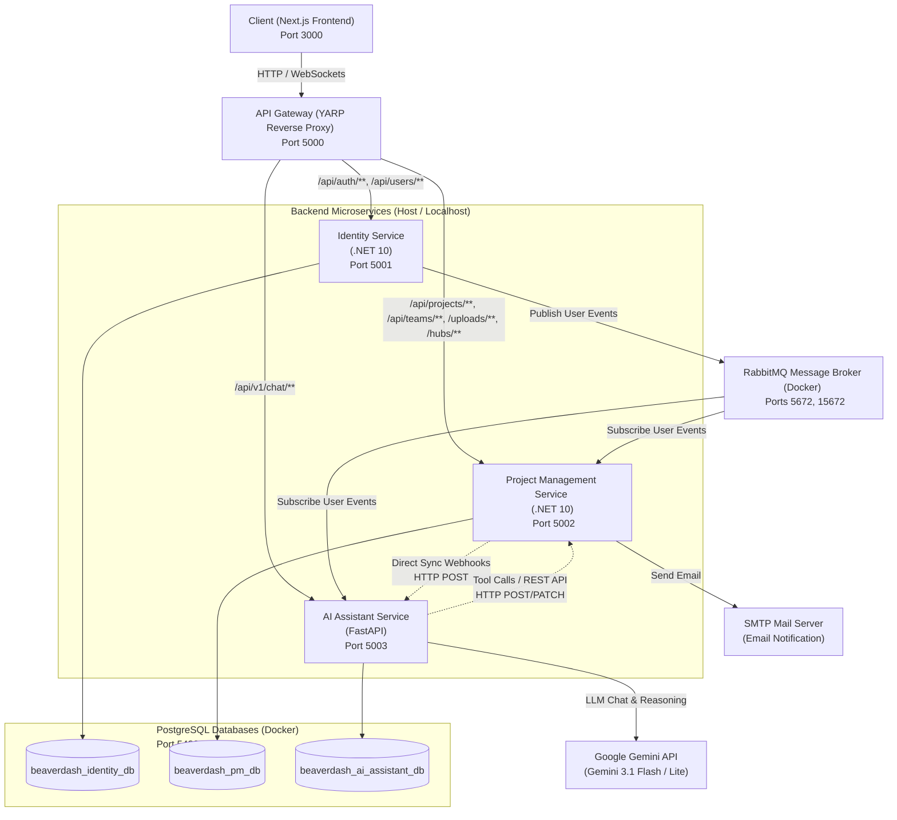
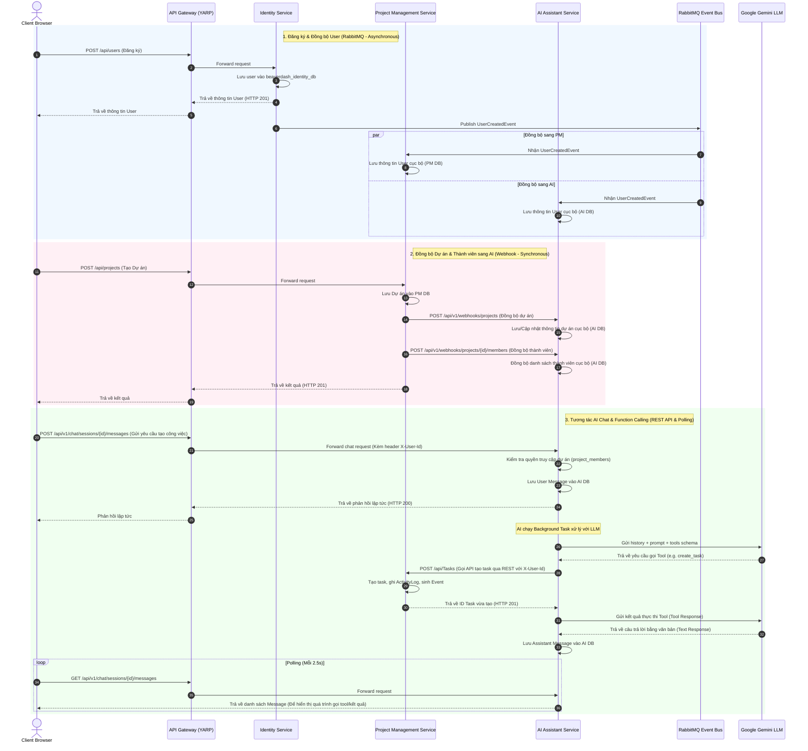
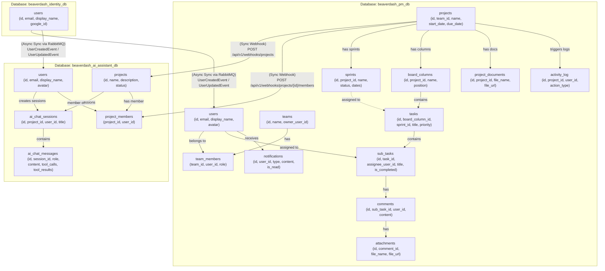
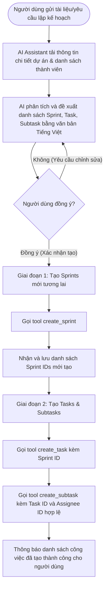

# Tài liệu Kiến trúc Hệ thống Beaverdash

Tài liệu này cung cấp cái nhìn chi tiết và toàn diện về kiến trúc hệ thống, các thành phần dịch vụ, mô hình dữ liệu, phương thức giao tiếp (đồng bộ & bất đồng bộ) và cơ chế bảo mật của dự án **Beaverdash** (Hệ thống quản lý công việc tích hợp Trợ lý AI).

---

## 1. Kiến trúc Tổng quan (High-Level Architecture)

Hệ thống Beaverdash được thiết kế theo kiến trúc **Microservices** tách biệt, phân chia nghiệp vụ rõ ràng để đạt được khả năng độc lập phát triển, triển khai và vận hành. 



### 1.1. Các thành phần chính và Phân bổ Port
* **Frontend Web ([web](file:///d:/beaverdash/web)):** Xây dựng bằng Next.js và Tailwind CSS, giao tiếp với backend thông qua API Gateway tại địa chỉ `http://localhost:5000`.
* **API Gateway ([ApiGateway](file:///d:/beaverdash/ApiGateway)):** Sử dụng **YARP Reverse Proxy** (.NET 10). Đây là điểm đầu vào (Entry point) duy nhất của các client, chịu trách nhiệm định tuyến, xử lý CORS, và thực hiện giải mã JWT (Authentication Offloading).
* **Identity Service ([IdentityService](file:///d:/beaverdash/IdentityService)):** Service backend chịu trách nhiệm quản lý người dùng, đăng ký, xác thực tài khoản qua Google và cấp phát token JWT. Sử dụng C# .NET 10.
* **Project Management Service ([ProjectManagementService](file:///d:/beaverdash/ProjectManagementService)):** Nghiệp vụ cốt lõi quản lý dự án, teams, board, task, sub-task, sprint, bình luận, tệp đính kèm và gửi thông báo real-time qua WebSockets (SignalR). Sử dụng C# .NET 10.
* **AI Assistant Service ([AIAssistantService](file:///d:/beaverdash/AIAssistantService)):** Trợ lý AI thông minh hỗ trợ phân tích tài liệu và tự động tạo/lập kế hoạch công việc bằng cách tích hợp LLM (Gemini 3.1 Flash/Lite) thông qua cơ chế Gọi công cụ (Function Calling). Sử dụng Python FastAPI.

### 1.2. Môi trường triển khai Hybrid (Hybrid Development Model)
Để tối ưu hóa hiệu năng máy tính của lập trình viên và tăng tốc độ phát triển:
* **Hạ tầng nền tảng (Database, Message Broker):** PostgreSQL và RabbitMQ được chạy ngầm thông qua Docker Desktop ([docker-compose.yml](file:///d:/beaverdash/docker-compose.yml)).
* **Các service nghiệp vụ & Frontend:** Chạy trực tiếp trên máy host (Localhost) để tận dụng Hot Reload (`dotnet watch`, `uvicorn --reload`, `npm run dev`) và dễ dàng gán breakpoint debug.

---

## 2. Giao tiếp giữa các Dịch vụ (Service-to-Service Communication)

Hệ thống áp dụng cả 2 phương thức giao tiếp để tối ưu hóa sự cân bằng giữa tính nhất quán và hiệu năng:



### 2.1. Giao tiếp Đồng bộ (Synchronous Communication via HTTP/REST)
* **API Gateway Routing:** YARP Gateway thực hiện định tuyến động các API từ Frontend xuống các Service nội bộ theo cấu hình tại [appsettings.Development.json](file:///d:/beaverdash/ApiGateway/appsettings.Development.json).
* **Đồng bộ Dữ liệu Dự án (Webhooks):** Khi một dự án được tạo/cập nhật hoặc thay đổi thành viên trong PM Service, service này sẽ phát động một HTTP POST đồng bộ sang Webhook của AI Service (`POST /api/v1/webhooks/projects` và `POST /api/v1/webhooks/projects/{project_id}/members`). Logic này được bọc an toàn trong client [AIAssistantServiceClient.cs](file:///d:/beaverdash/ProjectManagementService/src/PM.Infrastructure/Services/AIAssistantServiceClient.cs) để tránh lỗi ảnh hưởng tiến trình chính.
* **Gọi Công cụ AI (Function Calling/Tool calls):** Khi Trợ lý AI quyết định gọi công cụ để tạo/cập nhật sprint, task, sub-task, FastAPI AI Service sẽ trực tiếp gọi REST API ngược lại PM Service thông qua các endpoint HTTP chuẩn (ví dụ `POST /api/Tasks`, `POST /api/SubTasks`, `POST /api/Sprints`). Các lời gọi này luôn mang theo Header `X-User-Id` để đảm bảo ngữ cảnh người dùng được bảo toàn.

### 2.2. Giao tiếp Bất đồng bộ (Asynchronous Event-Driven via RabbitMQ)
* **Message Broker:** Hệ thống sử dụng RabbitMQ để truyền tải các sự kiện thay đổi dữ liệu mà không cần các service phải đợi nhau.
* **Đồng bộ Tài khoản Người dùng (User Lifecycle):** 
  * Khi người dùng đăng ký hoặc đăng nhập qua Google, **Identity Service** sẽ ghi nhận thông tin và publish event `UserCreatedEvent` hoặc `UserUpdatedEvent` lên RabbitMQ Event Bus.
  * **Project Management Service** và **AI Assistant Service** đăng ký lắng nghe các event này để đồng bộ thông tin user (như `display_name`, `email`, `avatar`) về cơ sở dữ liệu nội bộ của riêng mình. Điều này giúp các service có thể truy vấn thông tin người dùng ngay lập tức mà không cần gọi chéo REST API sang Identity Service.

---

## 3. Kiến trúc Cơ sở Dữ liệu & Tính Tự chủ (Database Isolation & Service Autonomy)

Để đạt được tiêu chuẩn kiến trúc Microservices thuần túy, Beaverdash áp dụng triệt để nguyên tắc **Database-per-Service** (Mỗi dịch vụ có cơ sở dữ liệu riêng biệt). Không có bất kỳ truy vấn trực tiếp chéo cơ sở dữ liệu nào giữa các dịch vụ.



### 3.1. Phân rã dữ liệu và Nhân bản dữ liệu (Data Replication)
* **Bảng `users` cục bộ:** Cả 3 cơ sở dữ liệu đều có bảng `users`. Identity DB nắm giữ quyền quản lý thông tin gốc (source of truth). PM DB và AI DB chứa phiên bản nhân bản (công khai) phục vụ các phép JOIN dữ liệu hiển thị (ví dụ: hiển thị tên người được giao việc hoặc hiển thị avatar trong chat) để đảm bảo tốc độ phản hồi tối đa.
* **Bảng `projects` và `project_members` cục bộ ở AI DB:** Dùng để AI Assistant kiểm tra quyền truy cập dự án ngay lập tức khi nhận yêu cầu chat mà không cần phải thực hiện các cuộc gọi REST API xác minh chậm chạp sang PM Service.

### 3.2. Cơ chế Lưu trữ và Đảm bảo giao tiếp đáng tin cậy
* **Outbox Pattern (PM Service):** 
  * Để đảm bảo các sự kiện nghiệp vụ quan trọng không bị thất lạc (ví dụ: gửi thông báo qua SignalR/Email khi cập nhật task), PM Service áp dụng mẫu thiết kế **Outbox Pattern**.
  * Các sự kiện thay đổi dữ liệu sẽ được lưu cùng một Transaction vào bảng `outbox_messages` trong CSDL PM DB.
  * Một tiến trình chạy nền (`OutboxBackgroundService` trong [.NET Worker Hosted Service](file:///d:/beaverdash/ProjectManagementService/src/PM.API/Program.cs)) sẽ liên tục đọc bảng này để đẩy sự kiện lên RabbitMQ/SignalR, đảm bảo phân phát sự kiện đáng tin cậy tối thiểu một lần (At-Least-Once Delivery).
* **Lưu trữ Tệp Vật Lý:** Các tệp đính kèm công việc (Attachments) và tài liệu dự án (Project Documents) tải lên từ người dùng sẽ được lưu trữ trực tiếp tại thư mục vật lý `/app/wwwroot/uploads` của container PM Service. Đường dẫn tương đối `/uploads/filename` sẽ được định tuyến thông qua API Gateway `/uploads` route để phân phối trực tiếp cho Client.

Để biết thêm chi tiết các kiểu dữ liệu chi tiết của từng bảng, vui lòng tham khảo file tài liệu [database.md](file:///d:/beaverdash/docs/database.md).

---

## 4. Quy trình Lập kế hoạch & Tạo công việc của Trợ lý AI

Trợ lý AI sử dụng API Gemini để giao tiếp và kích hoạt công cụ. Để đảm bảo tính chính xác và an toàn dữ liệu, AI Assistant tuân thủ nghiêm ngặt quy trình gồm 2 giai đoạn (Two-Phase Execution Loop):



### 4.1. Chi tiết các Công cụ (Tools) của AI Assistant
AI Service định nghĩa các tool Python trong [assistant_tools.py](file:///d:/beaverdash/AIAssistantService/app/services/assistant_tools.py) để Gemini gọi trực tiếp thông qua cơ chế Gọi hàm:
1. `get_project_details()`: Lấy thông tin ngày bắt đầu/hạn hoàn thành của dự án và danh sách thành viên dự án (kèm ID người dùng và vai trò).
2. `get_project_sprints()`: Lấy danh sách các Sprints hiện có trong dự án.
3. `create_sprint(name, goal, start_date, end_date)`: Tạo Sprint mới.
4. `create_task(title, priority, start_date, due_date, status, sprint_id)`: Tạo công việc cha.
5. `create_subtask(task_id, title, due_date, assignee_id)`: Tạo nhiệm vụ con gắn với công việc cha và phân công thành viên.
6. `get_project_tasks(assignee_name, status_type, due_date_filter)`: Lọc tìm danh sách công việc hiện tại của dự án để AI báo cáo hoặc theo dõi tiến độ.
7. `update_task()` và `update_subtask()`: Cập nhật thông tin công việc hoặc nhiệm vụ hiện tại.

---

## 5. Bảo mật và Quản lý Bối cảnh (Security & Context Propagation)

### 5.1. Mô hình Xác thực Offloading (Authentication Offloading)
* Client gửi JWT token đính kèm trong header `Authorization: Bearer <Token>` đến API Gateway.
* API Gateway (YARP) chịu trách nhiệm xác minh tính hợp lệ của token JWT. Nếu không hợp lệ hoặc hết hạn, Gateway chặn đứng cuộc gọi và trả về lỗi `401 Unauthorized`.
* Nếu token hợp lệ, Gateway sẽ bóc tách User ID từ payload của JWT và đẩy vào header HTTP mới với tên `X-User-Id` trước khi chuyển tiếp (forward) request xuống các Service backend (`IdentityService`, `ProjectManagementService`, `AIAssistantService`).
* Các service backend không cần xác thực lại JWT mà trực tiếp lấy danh tính người dùng từ header `X-User-Id` thông qua cơ chế `CurrentUserService`.

### 5.2. Phân Quyền Trong AI Service (Authorization Check)
* Nhằm đảm bảo bảo mật dữ liệu dự án, khi người dùng yêu cầu tương tác chat hoặc xem lại lịch sử phiên chat trong `AIAssistantService` (các API bắt đầu bằng `/api/v1/chat/sessions/**`), service sẽ lấy `X-User-Id` và kiểm tra xem người dùng đó có tồn tại trong bảng `project_members` của dự án tương ứng hay không.
* Nếu người dùng không thuộc dự án, hệ thống trả về ngay lỗi `403 Forbidden`. Điều này ngăn chặn việc đánh cắp thông tin dự án qua API chat.

---

## 6. Cấu trúc Thư mục Dự án (Monorepo Layout)

Dự án Beaverdash áp dụng cấu trúc Monorepo để dễ dàng quản lý mã nguồn, chia sẻ các mô hình thông điệp và đồng bộ phát triển.

```text
Beaverdash/ (Monorepo Root)
├── Beaverdash.slnx               # Cấu trúc Solution file quản lý các project .NET 10
├── docker-compose.yml            # Khởi chạy Postgres (pgvector) và RabbitMQ
├── .env.example                  # Template biến môi trường
├── start.bat                     # Script khởi chạy nhanh toàn bộ hệ thống ở local
│
├── ApiGateway/                   # C# .NET 10 API Gateway (YARP)
│   ├── Program.cs                # Đăng ký Routing, CORS và Authentication
│   └── appsettings.Development.json
│
├── IdentityService/              # C# .NET 10 Identity Service
│   └── src/
│       └── Identity.API/
│           ├── Program.cs        # Cấu hình JWT & Connection String
│           ├── Controllers/      # AuthController (Đăng nhập), UsersController (Đăng ký)
│           ├── Domain/           # Thực thể User
│           └── Infrastructure/   # Data Context & RabbitMQ MassTransit Producer
│
├── ProjectManagementService/     # C# .NET 10 Project Management Service (Clean Architecture)
│   └── src/
│       ├── PM.Domain/            # Lớp Domain: Định nghĩa 10 Thực thể nghiệp vụ & Domain Events
│       ├── PM.Application/       # Lớp Application: Chứa CQRS Handlers (MediatR) & Contracts
│       ├── PM.Infrastructure/    # Lớp Infrastructure: EF Core DbContext, Repositories, RabbitMQ Consumers, Outbox Worker
│       └── PM.API/               # Lớp API: Controllers phơi bày Endpoint, SignalR Hubs
│
├── AIAssistantService/           # Python FastAPI AI Assistant Service
│   ├── Dockerfile
│   ├── requirements.txt
│   └── app/
│       ├── main.py               # FastAPI Bootstrap & lifespan worker startup
│       ├── api/v1/               # Các endpoint chat, webhook sync
│       ├── core/                 # Cấu hình ứng dụng, bảo mật và kết nối DB
│       ├── models/               # Định nghĩa Model SQLAlchemy (user, project, member, chat)
│       ├── schemas/              # Pydantic schemas xác thực dữ liệu đầu vào
│       ├── services/             # Assistant Service tích hợp Gemini SDK & các tool API
│       └── worker/               # Consumer RabbitMQ nhận các event từ Identity Service
│
└── web/                          # Next.js Frontend Web Application
    ├── package.json
    ├── src/
    │   ├── app/                  # Next.js App Router (Dashboard, Projects, Boards, Chat, Assistant)
    │   ├── components/           # Các component giao diện UI (Kanban, AI Chat Interface)
    │   └── hooks/                # Custom React hooks quản lý kết nối API & SignalR Hubs
```

---

## 7. Tổng kết Công nghệ Sử dụng (Tech Stack Summary)

| Tầng / Thành phần | Công nghệ tiêu biểu | Phiên bản / Chi tiết |
| :--- | :--- | :--- |
| **Frontend Framework** | Next.js, React | Next.js 15, TypeScript |
| **Styling & UI Components** | Tailwind CSS | Tối ưu hóa giao diện Kanban và Chat |
| **API Gateway** | C# .NET 10, YARP | Microsoft.AspNetCore.App, YARP Reverse Proxy |
| **Backend Services (.NET)** | C# .NET 10 | Clean Architecture, CQRS (MediatR), SignalR |
| **Backend Services (Python)**| Python, FastAPI | Uvicorn, SQLAlchemy (asyncpg), Pydantic |
| **AI Integration** | Google GenAI SDK | Model **Gemini 3.1 Flash / Lite** (Function Calling) |
| **Event Bus (Broker)** | RabbitMQ | MassTransit (C#), pika/aio-pika (Python) |
| **Database Engines** | PostgreSQL | Docker container `pgvector/pgvector:pg15` |
| **Database ORM (.NET)** | Entity Framework Core | EF Core PostgreSQL (Code-First Migration) |
| **Database ORM (Python)** | SQLAlchemy | ORM bất đồng bộ với driver `asyncpg` |
| **Real-time Notifications** | SignalR (WebSockets) | Bắn cập nhật Kanban, ActivityLog và Notify |
| **Mail Server** | SMTP | Gửi thông báo nhắc việc qua Email |